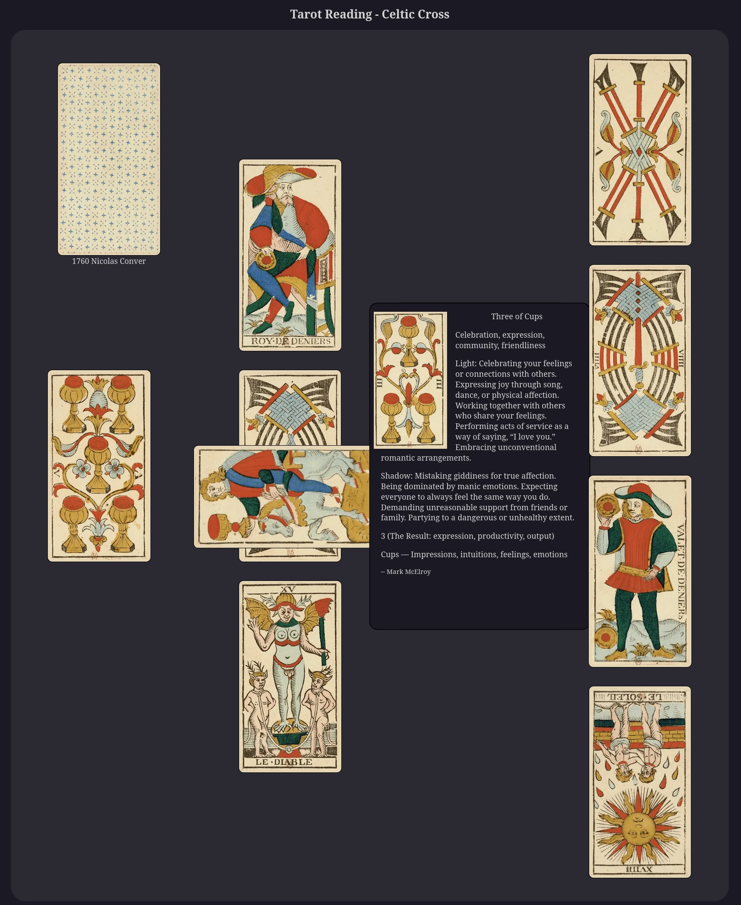

# Tarot-Reading-Web
Simple Tarot reading with vintage card images using HTML, CSS, JavaScript.

I wanted play with ImageMagick and GIMP. I had also been exploring the online museum archives of old Tarot cards.  Decided to see if I could clean the cards up a bit. Then I wanted to play with JavaScript and thus I made this.

If you want to play with it you should be able to just download as a zip, unzip, and load the html files in a web browser:

[Tarot-Reading-Web-main.zip](https://github.com/LeeBigelow/Tarot-Reading-Web/archive/refs/heads/main.zip)

``` 
unzip Tarot-Reading-Web-main.zip
cd Tarot-Reading-Web-main
firefox five-card-story.html
```

Or git clone it:

```
git clone https://github.com/LeeBigelow/Tarot-Reading-Web.git
cd Tarot-Reading-Web
firefox celtic-cross.html
```

Nothing fancy. So far just a Celtic-Cross or Five-Card-Story layout. Click on the deck to deal out the cards. Click on a card to flip and get some interpretation info. The top left has "Decks" and "Layouts" menus. You can switch decks at any time and have cards from different decks in the same layout. Switching layouts will restart the reading. A random deck gets selected at the start of each reading.

Unfortunately won't work on your phone. Phone browsers don't seem to like reading local files. Probably have to make it an app, or some sort of all-in-one self contained file. Still, feel free to use and modify at will.

I also have some notes on how I modified the images if you're keen.

If you just want to browse the deck images here's a Google Drive folder of the deck images: [Tarot Deck on Google Drive](https://drive.google.com/drive/folders/1u3_QSi-YJDf84ZH5FjdO13Tc_AFnhNWU?usp=drive_link)

## Image Sources

- [1709 Pierre Madenié (no trumps) - British Museum](https://www.britishmuseum.org/collection/object/P_1896-0501-590-1-56)
- [1709 Pierre Madenié (only trumps) - tarot-demarseille-millennium.com](https://tarot-de-marseille-millennium.com/galerie_tarots_historiques.html)    
- [1760 Nicolas Conver - gallica.bnf.fr](https://gallica.bnf.fr/ark:/12148/btv1b10537352g)
- [1760 Nicolas Conver (1890 Camoin reprint) - gallica.bnf.fr](https://gallica.bnf.fr/ark:/12148/btv1b10543309g)
- [1789 Etteilla's Livre de Thot](https://publicdomainreview.org/collection/etteilla-thot/)
- [1835 Gumppenberg Dellarocca - British Museum](https://www.britishmuseum.org/collection/object/P_1896-0501-12?selectedImageId=1585994001)
- [1835 Gumppenberg Dellarocca - etteilla.org](https://etteilla.org/en/deck/33/original-gumppenberg-dellarocca-tarot)
- [1910 Rider Waite Smith - archive.org](https://archive.org/details/rider-waite-tarot)
- [2010 Yoav Ben-Dov (Nicolas Conver reproduction)](https://cbdtarot.com/the-cards/)

## Meanings

- [The Pictorial Key to the Tarot By Arthur Edward Waite](https://sacred-texts.com/tarot/pkt/index.htm)
- [The Tarot By S. L. MacGregor Mathers](https://sacred-texts.com/tarot/mathers/index.htm)
- [Le grand Etteilla, ou, l'art de tirer les cartes](https://archive.org/details/b29321220)
- [Etteilla in English](https://stolen-thyme.com/etteilla-in-english/)
- [Mark McElroy via TarotTools.com (creative commons share and share alike)](https://tarottools.com/tarot-card-meanings-toc)
- [Yoav Ben-Dov Little-White-Book](https://cbdtarot.com/download/)

## Screenshot


