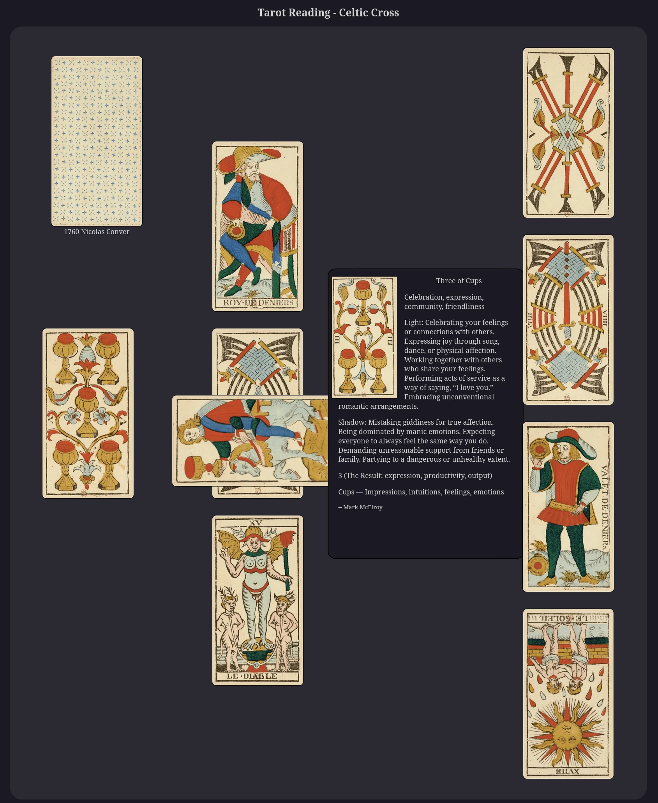

# Tarot-Reading-Web
Simple Tarot reading with vintage card images using HTML, CSS, JavaScript.

You can use the online live version here: [Tarot-Reading-Web](https://leebigelow.github.io/Tarot-Reading-Web)

I had been exploring the online museum archives of old Tarot cards and wanted to try cleaning up the images with ImageMagick and GIMP.  Then I decided to put the cleaned images to use and made this little Tarot reading program.

To use it you should be able to download as a zip, unzip, and load the html files in a web browser:

[Tarot-Reading-Web-main.zip](https://github.com/LeeBigelow/Tarot-Reading-Web/archive/refs/heads/main.zip)

``` 
unzip Tarot-Reading-Web-main.zip
cd Tarot-Reading-Web-main
firefox five-card-story.html
```

Or git clone it:

```
git clone https://github.com/LeeBigelow/Tarot-Reading-Web.git
cd Tarot-Reading-Web
firefox celtic-cross.html
```

Nothing fancy. So far just Celtic-Cross, Five-Card-Story, or Ten-Card-Triangle layouts. Click on the deck to deal out the cards. Click on a card to flip and get some interpretation info. The top left has "Decks" and "Layouts" menus. You can switch decks at any time and have cards from different decks in the same layout.

## Embedded versions for phones

You can use the [online version](https://LeeBigelow.github.io/Tarot-Reading-Web) on your phone or tablet but unfortunately you can't download and run it off-line on your device. Phone and tablet browsers don't like reading external javascript and css files. Instead I've made some embedded versions where the css, javascript, and card images (compressed and base64 encoded) are all rolled into one html. Each "layout & deck" combo is given it's own separate all-in-one html file that your device's browser will be able to run. 

Just download one of the embedded html files from the Google Drive folder below (which ever "layout & deck" combo you like) then open it with your device's browser. They work on my phone and hopefully will work on yours.

[Folder of Completely Embedded Versions (for the phone)](https://drive.google.com/drive/folders/1lbfcxlHbkPkIrWJ4lBdQcY3va5lfuAQf?usp=sharing)

The folder also contains some screenshots if you want to check out the decks in various layouts.

Note: the script I used to create the embedded html is included (tools/make-embedded.sh).

## The Card Images

I've included some notes on how I modified the images with Imagemagick and Gimp for those interested.

If you just want to browse through the card images here's a Google Drive folder of the decks:

[Tarot Decks on Google Drive](https://drive.google.com/drive/folders/1u3_QSi-YJDf84ZH5FjdO13Tc_AFnhNWU?usp=drive_link)

## Image Sources

- [1709 Pierre Madenié (no trumps) - British Museum](https://www.britishmuseum.org/collection/object/P_1896-0501-590-1-56)
- [1709 Pierre Madenié (only trumps) - tarot-demarseille-millennium.com](https://tarot-de-marseille-millennium.com/galerie_tarots_historiques.html)    
- [1760 Nicolas Conver - gallica.bnf.fr](https://gallica.bnf.fr/ark:/12148/btv1b10537352g)
- [1760 Nicolas Conver (1890 Camoin reprint) - gallica.bnf.fr](https://gallica.bnf.fr/ark:/12148/btv1b10543309g)
- [1789 Etteilla's Livre de Thot](https://publicdomainreview.org/collection/etteilla-thot/)
- [1835 Gumppenberg Dellarocca - British Museum](https://www.britishmuseum.org/collection/object/P_1896-0501-12?selectedImageId=1585994001)
- [1835 Gumppenberg Dellarocca - etteilla.org](https://etteilla.org/en/deck/33/original-gumppenberg-dellarocca-tarot)
- [1910 Rider Waite Smith - archive.org](https://archive.org/details/rider-waite-tarot)
- [2010 Yoav Ben-Dov (Nicolas Conver reproduction)](https://cbdtarot.com/the-cards/)

## Meanings

- [The Pictorial Key to the Tarot By Arthur Edward Waite](https://sacred-texts.com/tarot/pkt/index.htm)
- [The Tarot By S. L. MacGregor Mathers](https://sacred-texts.com/tarot/mathers/index.htm)
- [Le grand Etteilla, ou, l'art de tirer les cartes](https://archive.org/details/b29321220)
- [Etteilla in English](https://stolen-thyme.com/etteilla-in-english/)
- [Mark McElroy via TarotTools.com (creative commons share and share alike)](https://tarottools.com/tarot-card-meanings-toc)
- [Yoav Ben-Dov Little-White-Book](https://cbdtarot.com/download/)

## Screenshot


